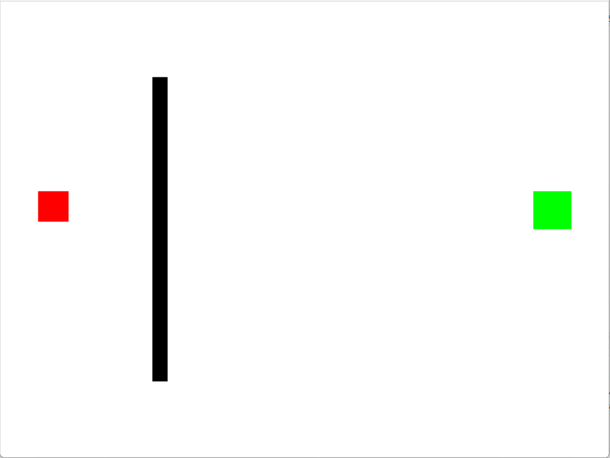
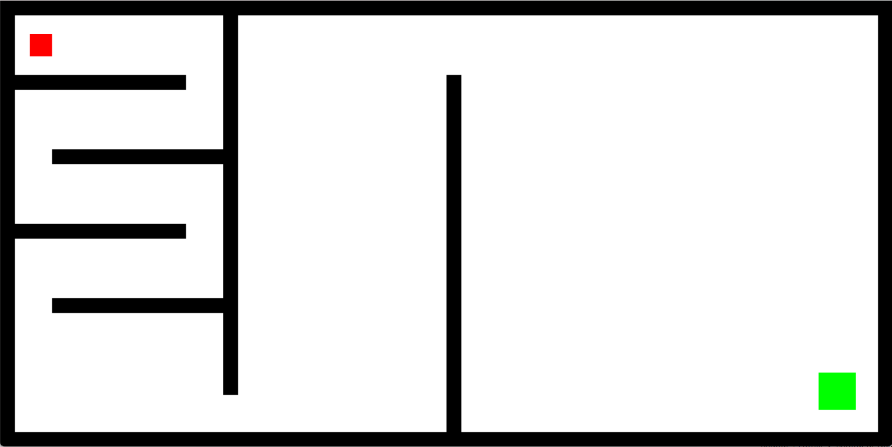
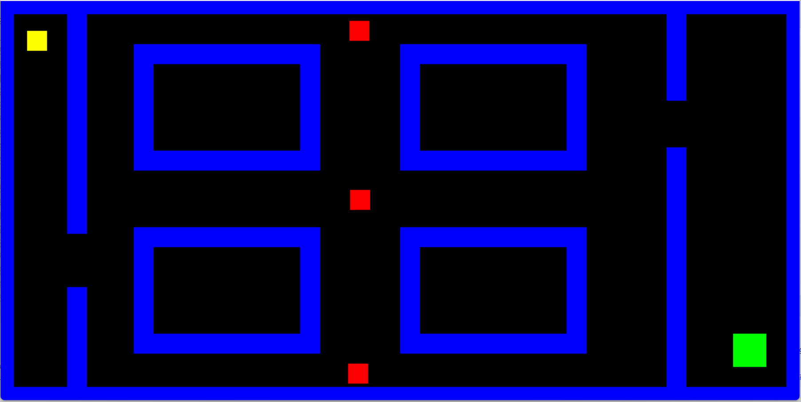

# DAL MURO AL LABIRINTO

## Crea un rettangolo Player

### Crea un rettangolo Obiettivo

#### Crea un muro

- Gestisci le collisioni
- Aggiungi più muri

*Figura con singolo muro*

_Figura con labirinto_

Figura con labirinto e nemici
