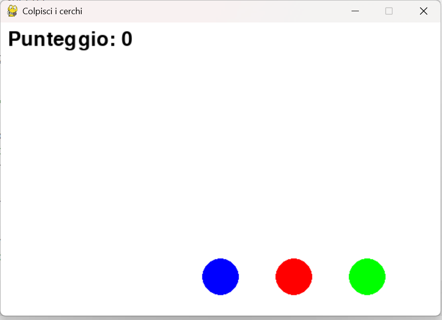

# 🟢 Lezione: Colpisci i Cerchi



## 🎯 Obiettivi
In questa  lezione ripasserai:
- L’uso di **liste** per memorizzare oggetti (in questo caso cerchi)
- La creazione e l’uso di **funzioni** per organizzare il codice
- La gestione degli **eventi del mouse e della tastiera** con Pygame
- La visualizzazione grafica con `pygame.draw.circle`

Il risultato finale sarà un mini gioco in cui:
> Premi **SPAZIO** per generare nuovi cerchi e **cliccali** per guadagnare punti.  
> Se un cerchio tocca il fondo, perdi 1 punto.

---

## 🧠 Concetti chiave

| Concetto | Spiegazione |
|-----------|--------------|
| **Liste di oggetti** | Ogni cerchio è rappresentato da una lista `[x, y, colore, raggio]` e tutti i cerchi sono dentro una lista principale `cerchi`. |
| **Funzioni** | Servono per organizzare il codice (es. `disegna_cerchi`, `muovi_cerchi`, `aggiungi_cerchio`, `clic_su_cerchi`). |
| **Eventi Pygame** | Gli eventi come `MOUSEBUTTONDOWN` e `KEYDOWN` vengono gestiti nel ciclo principale. |
| **Coordinate** | `(x, y)` rappresentano il centro del cerchio. |
| **Collisione clic–cerchio** | Si calcola con la distanza: `math.sqrt((x - mx)**2 + (y - my)**2) <= r`. |

---

## 🧩 Istruzioni di lavoro

1. Apri il file `template.py`.
2. Completa i `# TODO` nelle seguenti funzioni:
   - `disegna_cerchi(lista_cerchi)`
   - `muovi_cerchi(lista_cerchi, speed)`
   - `aggiungi_cerchio(lista_cerchi)`
   - `clic_su_cerchi(lista, pos_mouse)`
3. Esegui il programma e verifica che:
   - Premendo **SPAZIO** appaiano nuovi cerchi colorati in alto
   - I cerchi scendano verso il basso
   - Se clicchi su un cerchio, il punteggio aumenta
   - Se un cerchio tocca il fondo, viene rimesso in alto e perdi 1 punto

---

## 💡 Suggerimenti

- Usa `random.randint()` per generare coordinate casuali
- Usa `pygame.draw.circle()` per disegnare
- Usa `math.sqrt()` per calcolare la distanza tra due punti
- Per cambiare un cerchio nel tempo, puoi modificare direttamente i suoi valori nella lista

Esempio:
```python
for cerchio in lista_cerchi:
    cerchio[1] += speed  # aumenta la coordinata y

